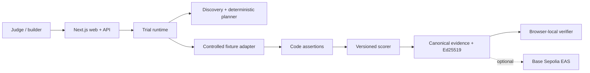

# AgentTrial

> **AI agents make claims. AgentTrial makes them prove it.**

The evidence layer for agent marketplaces. AgentTrial discovers an agent’s advertised capabilities, seals claim-specific adversarial trials before execution, verifies observations with deterministic assertions, and signs a tamper-evident evidence bundle.


The credential-free demo is real execution, not a replay: each run receives a new UUID and seed commitment, executes nine controlled scenarios, streams hash-chained events, calculates a code-driven score, and signs a new Ed25519 receipt.

## Three-minute local quickstart

Requirements: Node.js 24+, Corepack, and pnpm 11.

```bash
corepack enable
pnpm install
pnpm dev
```

Open [http://localhost:3000](http://localhost:3000), choose **Run a live trial**, then select either controlled fixture. No OpenAI key, wallet, GitHub token, database, or account is required.

```bash
# Full quality gate
pnpm format:check
pnpm lint
pnpm typecheck
pnpm test
pnpm build
pnpm exec playwright install chromium
pnpm test:e2e
pnpm audit
pnpm secret-scan
```

## What is implemented

- Explicit 13-state pipeline from `CREATED` through `COMPLETED`, with illegal-transition rejection and typed cancellation/failure.
- Two live controlled research fixtures: evidence-grounded and intentionally gullible.
- Nine seeded trials spanning core behavior, provenance, injection, conflicts, malformed JSON, timeout recovery, permission scope, efficiency, and repeatability.
- Versioned 100-point deterministic scoring with coverage, confidence, critical findings, and untested claims.
- Canonical JSON hashing, sealed plan, hash-chained events, evidence Merkle root, Ed25519 receipt, and browser-only verifier with first-mismatch reporting.
- Real SSE timeline, full report, bundle download, tamper demo, methodology/security/developer screens, polished errors, and responsive accessibility.
- Current OpenAI Responses API provider with structured Zod output plus a deterministic no-key provider.
- SSRF URL/DNS primitives, secret redaction, hard budgets, active-consent enforcement, CSP, and passive-only external-target policy.
- Base Sepolia EAS schema encoding, guarded registration/attestation scripts, and local receipt fallback.
- OpenAPI 3.1, A2A 1.0 Agent Card, `llms.txt`, health, and readiness endpoints.

## Architecture



Workspace packages separate typed domain logic (`core`), fixtures, evidence, network safety, planner providers, runtime orchestration, and EAS encoding. The demo store is process-local by design; production multi-instance durability is the principal pre-launch limitation. See [architecture](docs/architecture.md) and [limitations](docs/limitations.md).

## Environment

Copy `.env.example` to `.env.local`. All values are optional for the controlled demo.

| Variable                  | Purpose                                                                                    |
| ------------------------- | ------------------------------------------------------------------------------------------ |
| `OPENAI_API_KEY`          | Enables the optional real planner; server-only.                                            |
| `OPENAI_MODEL`            | Required with the key; deliberately no hard-coded model default.                           |
| `AGENTTRIAL_SIGNING_SEED` | 64 hex characters for a stable Ed25519 development/service identity. Use a secret manager. |
| `NEXT_PUBLIC_APP_URL`     | Canonical deployment origin.                                                               |
| `EAS_RPC_URL`             | Base Sepolia RPC URL.                                                                      |
| `EAS_PRIVATE_KEY`         | Testnet attestor wallet; server/script only.                                               |
| `EAS_SCHEMA_UID`          | Registered AgentTrial schema UID.                                                          |
| `REPORT_URI`              | Optional public evidence/report URI for the attestation.                                   |

Never prefix private values with `NEXT_PUBLIC_`. An ephemeral signing key is generated at process start when no seed is configured; that is convenient locally but not a stable production identity.

## Base Sepolia / EAS

The schema uses Base Sepolia chain ID `84532`, EAS `0x4200…0021`, and Schema Registry `0x4200…0020`. Scripts refuse to broadcast unless the exact `--confirm-base-sepolia` flag is supplied.

```bash
node scripts/eas-register.mjs --confirm-base-sepolia
node scripts/eas-attest.mjs agenttrial-RUN_ID.json --confirm-base-sepolia
```

These commands spend Base Sepolia test ETH. Mainnet broadcasting is intentionally unsupported by the scripts. Attestation failure never blocks the signed local report.

## Deploy

For a single-instance review deployment, use the provided Docker image or set the Vercel project root to this repository. The UI/API and SSE runtime must share a process until a durable run-store adapter is added.

```bash
docker compose up --build
```

The container runs as a non-root user with a read-only filesystem, no Linux capabilities, and `no-new-privileges`. External website/browser evaluation is disabled until a separately isolated, egress-restricted worker is deployed.

## Documentation

- [Architecture](docs/architecture.md)
- [Evaluation methodology](docs/methodology.md)
- [Threat model](docs/threat-model.md)
- [Responsible use](docs/responsible-use.md)
- [API](docs/api.md)
- [Deployment](docs/deployment.md)
- [Demo script](docs/demo-script.md)
- [Orion submission copy](docs/submission.md)
- [Judging map](docs/judging-map.md)
- [Launch plan](docs/launch-plan.md)
- [Limitations](docs/limitations.md)
- [Contributing](CONTRIBUTING.md)

## License

Apache-2.0. See [LICENSE](LICENSE).
