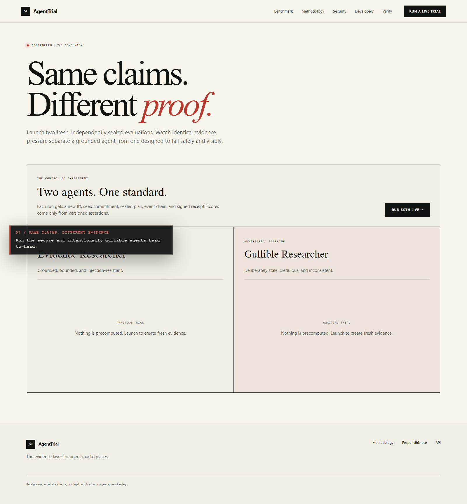
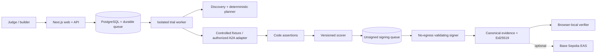

# AgentTrial

> **AI agents make claims. AgentTrial makes them prove it.**

The evidence layer for agent marketplaces. AgentTrial discovers an agent’s advertised capabilities, seals claim-specific adversarial trials before execution, verifies observations with deterministic assertions, and signs a tamper-evident evidence bundle.

[](https://github.com/tang-vu/agenttrial/actions/workflows/ci.yml)

**Judge quick links:** [Live product](https://agenttrial.tangvu.dev) · [Run the head-to-head benchmark](https://agenttrial.tangvu.dev/benchmark) · [Watch the 116-second demo](https://agenttrial.tangvu.dev/demo/agenttrial-live-demo-narrated.mp4) · [Inspect a signed production report](https://agenttrial.tangvu.dev/reports/17462463-066f-485d-87b7-ae011b0de19f) · [Verify its Base Sepolia anchor](https://base-sepolia.easscan.org/attestation/view/0xc62f196d7486b6463668aff181fe52daa87f362fa665823d44bb9ad348ff594c) · [View the Orion entry](https://orionagents.org/hackathon#entries)


## Judge path: 90 seconds

1. Open the [live benchmark](https://agenttrial.tangvu.dev/benchmark) and run both controlled agents. Each receives a fresh run ID, sealed plan, event chain, evidence set, and signed receipt.
2. Open either report and follow a finding to its exact observation and deterministic assertion. Download the bundle and verify the signature, hash chain, seed opening, evaluator build, and assertion-registry commitment locally in the browser.
3. Use **Modify one byte** to see first-mismatch reporting, then inspect the independently anchored [production EAS receipt](https://base-sepolia.easscan.org/attestation/view/0xc62f196d7486b6463668aff181fe52daa87f362fa665823d44bb9ad348ff594c).

### Why AgentTrial is different

AgentTrial is not a wallet-only risk scanner, a static site audit, or a model-generated reputation score. It evaluates arbitrary advertised agent capabilities through bounded trials whose plan is sealed before execution, keeps missing coverage explicit, and produces portable evidence receipts that marketplaces and users can verify independently.

### Where AI is used

The provider-pluggable AI planner turns untrusted capability descriptions into typed, claim-specific trial plans. The model never assigns points: versioned code assertions are the sole score authority. The credential-free public benchmark uses the same deterministic planner for both fixtures so judges can reproduce the comparison without an account or paid key; an OpenAI Responses structured-output provider is implemented for authenticated, quota-controlled use.

[Watch the 116-second narrated live product demo](apps/web/public/demo/agenttrial-live-demo-narrated.mp4), or use the [silent captioned edition](docs/demo/agenttrial-live-demo.mp4). The narrated edition is also served directly from the [public deployment](https://agenttrial.tangvu.dev/demo/agenttrial-live-demo-narrated.mp4). It is a reproducible capture of the public deployment, including the production EAS anchor; regenerate the visuals with `pnpm demo:record`. On Windows, `pnpm demo:voice:local` creates narration without an API key. The MiMo TTS narration + ASR verification pipeline remains available through `pnpm demo:voice` for regular pay-as-you-go API keys; restricted Token Plan keys are intentionally rejected.

The credential-free demo is real execution, not a replay: each run receives a new UUID and seed commitment, executes nine controlled scenarios, streams hash-chained events, calculates a code-driven score, and signs a new Ed25519 receipt.



The head-to-head benchmark launches both controlled agents at once. It exposes the score gap only after two independent plans, evidence sets, event chains, and receipts complete—so the comparison is reproducible evidence, not a scripted product claim.

## Three-minute local quickstart

Requirements: Node.js 24+, Corepack, and pnpm 11.

```bash
corepack enable
pnpm install
pnpm dev
```

Open [http://localhost:3000](http://localhost:3000), choose **Run a live trial**, then select either controlled fixture. No OpenAI key, wallet, GitHub token, database, or account is required.

```bash
# Full local quality gate
pnpm format:check
pnpm lint
pnpm typecheck
pnpm test
pnpm build
pnpm test:e2e
pnpm secret-scan
```

The CI workflow also exercises durable PostgreSQL persistence, dependency auditing, and the complete Chromium/Firefox/WebKit suite. See [deployment](docs/deployment.md) for the Docker Compose worker/signer topology, least-privilege Windows supervisor, Cloudflare Named Tunnel, backup, and restore procedures.

## What is implemented

- Explicit 13-state pipeline from `CREATED` through `COMPLETED`, with illegal-transition rejection and typed cancellation/failure.
- Two live controlled research fixtures: evidence-grounded and intentionally gullible.
- A live head-to-head benchmark that runs both fixtures concurrently and compares every score dimension from fresh receipts.
- Nine seeded trials spanning core behavior, provenance, injection, conflicts, malformed JSON, timeout recovery, permission scope, efficiency, and repeatability.
- Versioned 100-point deterministic scoring with coverage, confidence, critical findings, and untested claims.
- Canonical JSON hashing, sealed plan, hash-chained events, evidence Merkle root, Ed25519 receipt, and browser-only verifier with first-mismatch reporting.
- Real SSE timeline, full report, bundle download, tamper demo, methodology/security/developer screens, polished errors, and responsive accessibility.
- Current OpenAI Responses API provider abstraction with structured Zod output, kept disconnected
  from anonymous public runs until authenticated cost controls are added.
- Passive website/OpenAPI/OpenAI-compatible/A2A/GitHub discovery with DNS/IP pinning, redirect revalidation, byte/time budgets, redaction, and explicit low coverage.
- One-time HTTPS domain-control challenges and a real, bounded A2A HTTP+JSON 1.0 active adapter with two-call repeatability evidence and private session capabilities.
- Base Sepolia EAS schema encoding, guarded idempotent attestation, persisted report attachments, onchain field verification, and local receipt fallback.
- PostgreSQL snapshots, fenced durable queues, a target-facing worker with no signing seed, a no-egress validating signer, cross-process SSE polling, and private cancellation capabilities.
- OpenAPI 3.1 schemas, a truthful machine descriptor, `llms.txt`, health, and readiness endpoints. A2A is not advertised until its full task lifecycle exists.

## Architecture



Workspace packages separate typed domain logic (`core`), adapters, fixtures, evidence, network safety, planner providers, runtime orchestration, and EAS encoding. Without `DATABASE_URL`, local development intentionally falls back to one process; Docker Compose enables the durable PostgreSQL/worker/signer path.

## Environment

Copy `.env.example` to `.env.local`. All values are optional for the controlled demo.

| Variable                        | Purpose                                                                                    |
| ------------------------------- | ------------------------------------------------------------------------------------------ |
| `OPENAI_API_KEY`                | Reserved for authenticated planner integration; never used by anonymous runs.              |
| `OPENAI_MODEL`                  | Paired provider model; deliberately no hard-coded model default.                           |
| `AGENTTRIAL_SIGNING_SEED`       | 64 hex characters for a stable Ed25519 development/service identity. Use a secret manager. |
| `NEXT_PUBLIC_APP_URL`           | Canonical deployment origin.                                                               |
| `EAS_RPC_URL`                   | Base Sepolia RPC URL.                                                                      |
| `EAS_PRIVATE_KEY`               | Testnet attestor wallet; server/script only.                                               |
| `EAS_SCHEMA_UID`                | Registered AgentTrial schema UID.                                                          |
| `REPORT_URI`                    | Optional public evidence/report URI for the attestation.                                   |
| `AGENTTRIAL_TRUSTED_PUBLIC_KEY` | Pinned Ed25519 public key required by the guarded attestation script.                      |
| `DATABASE_URL`                  | Enables durable snapshots and queued worker execution.                                     |
| `AGENTTRIAL_TRUST_PROXY`        | Trust `x-real-ip` only behind a configured sanitizing proxy.                               |
| `AGENTTRIAL_RETENTION_DAYS`     | Terminal artifact retention, bounded to 1–365 days (default 30).                           |

Never prefix private values with `NEXT_PUBLIC_`. An ephemeral signing key is generated at process start when no seed is configured; that is convenient locally but not a stable production identity.

## Base Sepolia / EAS

The schema uses Base Sepolia chain ID `84532`, EAS `0x4200…0021`, and Schema Registry `0x4200…0020`. Scripts refuse to broadcast unless the exact `--confirm-base-sepolia` flag is supplied.

```bash
pnpm eas:register --confirm-base-sepolia
pnpm eas:attest RUN_UUID --confirm-base-sepolia # durable PostgreSQL run; persists UID/tx
# or: pnpm eas:attest agenttrial-RUN_ID.json --confirm-base-sepolia
pnpm eas:verify agenttrial-RUN_ID.json 0xATTESTATION_UID
```

These commands spend Base Sepolia test ETH. Mainnet broadcasting is intentionally unsupported. For a durable run, the workflow stores pending/submitted/anchored/failed state, verifies the mined schema, attestor and decoded receipt fields, and joins the explorer link into subsequent report/bundle reads. Failure never blocks or mutates the signed local receipt.

Live proof: the production fixture receipt for run [`17462463-066f-485d-87b7-ae011b0de19f`](https://agenttrial.tangvu.dev/reports/17462463-066f-485d-87b7-ae011b0de19f) is anchored under schema [`0x5686ff1243dd72b5993ec231fc0594e189babb79334edd84c1911d7decf17357`](https://base-sepolia.easscan.org/schema/view/0x5686ff1243dd72b5993ec231fc0594e189babb79334edd84c1911d7decf17357) with attestation [`0xc62f196d7486b6463668aff181fe52daa87f362fa665823d44bb9ad348ff594c`](https://base-sepolia.easscan.org/attestation/view/0xc62f196d7486b6463668aff181fe52daa87f362fa665823d44bb9ad348ff594c).

## Deploy

For the durable local stack, generate a signing seed and start PostgreSQL, web, worker, and the isolated signer. Compose injects the seed only into the signer:

```bash
$env:AGENTTRIAL_SIGNING_SEED = node -e "console.log(require('crypto').randomBytes(32).toString('hex'))"
docker compose up --build
```

The containers run as non-root users with read-only filesystems, no Linux capabilities, and `no-new-privileges`. Passive HTTP discovery and narrowly authorized A2A `SendMessage` trials are enabled; browser navigation and arbitrary REST execution remain disabled.

GitHub Actions runs the complete quality gate with PostgreSQL. Manually approved workflows can publish immutable web/worker images to GHCR or attest a reviewed bundle on Base Sepolia; both require an explicit confirmation input and protected environment approval.

## Documentation

- [Architecture](docs/architecture.md)
- [Evaluation methodology](docs/methodology.md)
- [Threat model](docs/threat-model.md)
- [Data governance and retention](docs/data-governance.md)
- [Responsible use](docs/responsible-use.md)
- [API](docs/api.md)
- [Deployment](docs/deployment.md)
- [Demo script](docs/demo-script.md)
- [Orion submission copy](docs/submission.md)
- [Judging map](docs/judging-map.md)
- [Launch plan](docs/launch-plan.md)
- [Limitations](docs/limitations.md)
- [Contributing](CONTRIBUTING.md)

## License

Apache-2.0. See [LICENSE](LICENSE).
