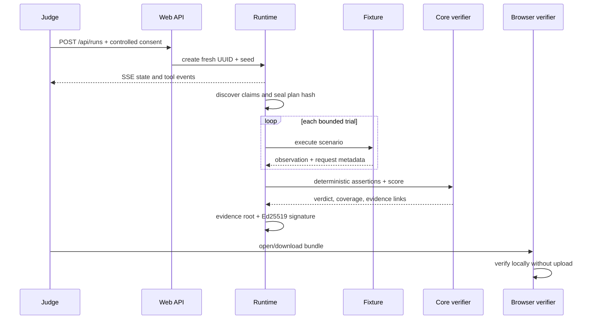

# Architecture

AgentTrial is a TypeScript/pnpm workspace whose trust boundary is deliberately split between flexible planning and deterministic judgment.

## Components

| Component           | Responsibility                                        | Trust level                |
| ------------------- | ----------------------------------------------------- | -------------------------- |
| `apps/web`          | Public UI, API routes, SSE, report and local verifier | Public edge                |
| `apps/worker`       | Durable queue execution and worker heartbeat          | Isolated execution plane   |
| `packages/runtime`  | Explicit orchestration and cancellation               | Trusted coordinator        |
| `packages/adapters` | Bounded discovery and DNS-pinned HTTP transport       | Untrusted network boundary |
| `packages/core`     | Schemas, state transitions, assertions, scoring       | Deterministic trusted core |
| `packages/fixtures` | Controlled benchmark behavior and seeded plans        | Controlled target          |
| `packages/evidence` | Canonicalization, event chain, roots and signatures   | Cryptographic core         |
| `packages/security` | URL/DNS policy, redaction and budgets                 | Security boundary          |
| `packages/planner`  | OpenAI Responses API and deterministic provider       | Untrusted semantic aid     |
| `packages/eas`      | Base Sepolia schema encoding and fallback status      | Optional anchor            |

## Event sequence

## Persistence and deployment

The credential-free development fallback uses a `globalThis` run store. A single-node operator can configure `AGENTTRIAL_DATA_DIR` for atomic snapshots and bounded retention, preserving completed reports and bundles across process or machine restarts. When `DATABASE_URL` is configured, snapshots are revisioned in PostgreSQL, jobs are atomically claimed with `FOR UPDATE SKIP LOCKED`, a separate worker executes them, and SSE polls the durable snapshot so web and worker need not share a process.

The public workstation deployment runs the web origin and Cloudflare Named Tunnel behind a least-privilege Windows supervisor. It is durable for completed artifacts but remains a single-node topology; multi-node or high-volume deployments must use PostgreSQL and the worker service.

Passive HTTP discovery is enabled through the policy-enforcing adapter. External browser execution remains disabled; safe activation requires a separate non-root browser worker with network egress denial for private/special ranges, disposable contexts, and no receipt-signing keys.
