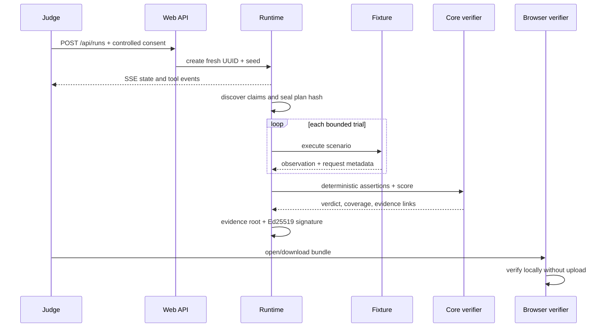

# Architecture

AgentTrial is a TypeScript/pnpm workspace whose trust boundary is deliberately split between flexible planning and deterministic judgment.

## Components

| Component           | Responsibility                                        | Trust level                |
| ------------------- | ----------------------------------------------------- | -------------------------- |
| `apps/web`          | Public UI, API routes, SSE, report and local verifier | Public edge                |
| `packages/runtime`  | Explicit orchestration and cancellation               | Trusted coordinator        |
| `packages/core`     | Schemas, state transitions, assertions, scoring       | Deterministic trusted core |
| `packages/fixtures` | Controlled benchmark behavior and seeded plans        | Controlled target          |
| `packages/evidence` | Canonicalization, event chain, roots and signatures   | Cryptographic core         |
| `packages/security` | URL/DNS policy, redaction and budgets                 | Security boundary          |
| `packages/planner`  | OpenAI Responses API and deterministic provider       | Untrusted semantic aid     |
| `packages/eas`      | Base Sepolia schema encoding and fallback status      | Optional anchor            |

## Event sequence

## Persistence and deployment

The current controlled demo uses a `globalThis` process-local run store. It supports fresh concurrent runs and SSE within one Node process, which is sufficient for the public judging path and Docker single-instance deployment. It is not horizontally durable. A production marketplace deployment must replace the `RuntimeRun` map/listener set with PostgreSQL plus a durable queue/pub-sub adapter while preserving the same typed runtime interface.

The external browser adapter is intentionally disabled in the public UI. Safe activation requires a separate non-root worker with network egress denial for private/special ranges, per-request policy enforcement, disposable contexts, and no receipt-signing keys.
